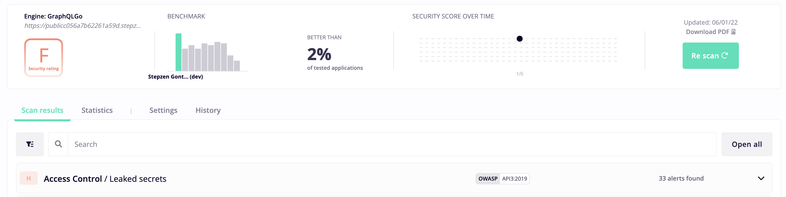
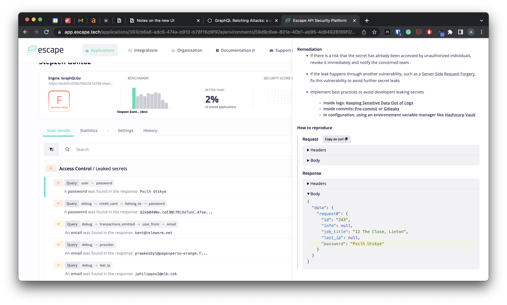

# Continuous security testing of your Stepzen API with Escape

## Creating a GraphQL API with Stepzen

You can use any source of data with Stepzen:

- a database
- a REST API
- a GraphQL API (inception)

For the sake of this blog post, let's say that we have internal applications that have populated a database and we would like to create a public-facing app fron that database.

As you might imagine this has some legitimate security concerns: leaking sensitive user data.

Problem: we need to move fast without compromising on security.

Lucky you, Stepzen and Escape makes the perfect combo!

Both tools are super fast to setup and let you started for free.

Let's see how it works

## Creating an API with Stepzen

1. Create your account on Stepzen
2. Install the CLI
3. Setup your endpoint with stepzen import ...
4. Build your API with stepzen start

And you are up and running! What a time to be alive!

For this, we used our fake API - an internal app.

Now before moving to production, we want to make sure we are not exposing ourselves to data leaks.

## Security monitoring with Escape

It is just as easy to get started with Escape

1. Create your account at app.escape.tech/register (reach out to get a registration key)
2. Create an application and configure your authentication method - or none if you don't have any
3. Your first scan will be triggered automatically



Oops!

Turns out we in did have some data leaks



Let's quickly fix that by configuring Stepzen

## Security configuration on Stepzen

## Launching Escape scans from the CI

Let's go one step further and setup Escape in the CI so that new scans are triggered when we push a change to our staging environment

For that we can create a Github action. Let's create a new file called `.github/workflows/escape.yaml`

And fill it in with this:

```yaml
name: Trigger Escape Scan

on:
  push:
    branches:
      - main

jobs:
  Escape:
    runs-on: ubuntu-latest
    steps:
      - name: Trigger scan
        uses: Escape-Technologies/escape-trigger-refresh@main
        with:
          environment_id: ${{ secrets.ESCAPE_ENVIRONMENT_ID }}
          api_key: ${{ secrets.ESCAPE_API_KEY }}
			on:
			  push:
			    branches:
			      - main
```

To get your API KEY and ENVIRONMENT ID go to the settings tab and under the "Scan triggering" section. You can then specify the secrets in the Github settings of your repository

// TODO: include image?

Now, whenever we push new changes to our `staging` branch, a new scan will be triggered (unless there's already one running).

## Conclusion

GraphQL is moving fast, and sometimes you need to move even faster. Can't waste your time building everything from scratch without compromising on quality, performance and security?

If that's you, try Stepzen and Escape today for free!

---

If anything, I hope that this post has shown you that picking a graphql-as-a-service solution shouldn't mean compromising on security. With Stepzen and Escape you get the quality, performance and security of a well-engineered application, minus the development time.
