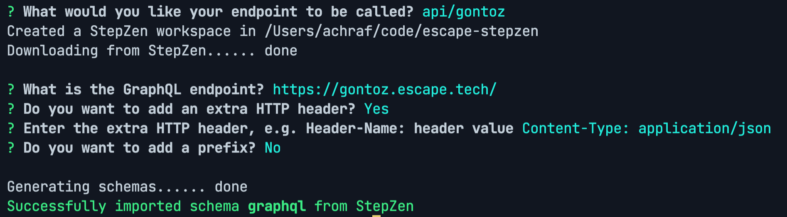

# StepZen x Escape

## Configuring StepZen

1. Create an account on https://stepzen.com (I logged in with my Github account)
2. You will get redirected here: https://stepzen.com/getting-started


3. Install the StepZen CLI:

```bash
sudo npm install -g stepzen
```

4. Log in with your StepZen account

```bash
stepzen login -a ACCOUNT_NAME
```


5. Launch the CLI prompt to configure your endpoint

```bash
stepzen import graphql
```



6. Build your endpoint

```bash
stepzen start
```

https://publicc056a7b62261a59d.stepzen.net/api/gontoz/__graphql

Story:

- You have an internal app that has been populating a database with information - examples are perhaps Github or a hotel booking system
- You want to quickly build a public-facing application and you need an API on top of that database

Application:

- Use gontoz.escape.tech through StepZen
-

## Todos

- Setup Escape in the CI
- Detect a data leak
- Make adequat changes in the app to fix it
  - Use the skip directive to hide some fields (like password)
  - Use the skip directive to configure access control?
