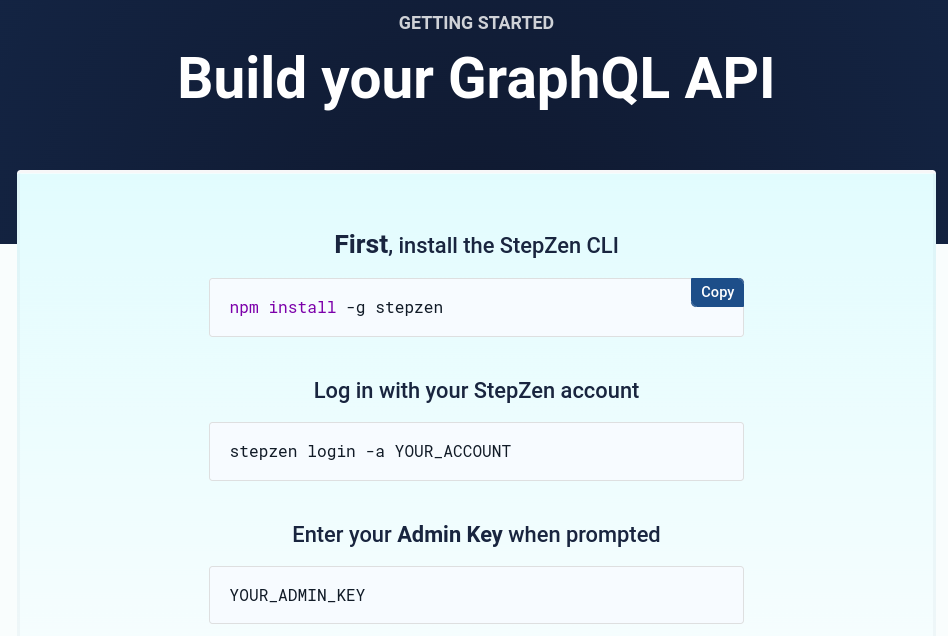
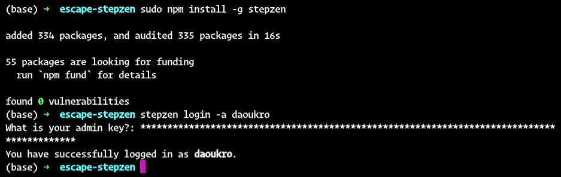

# StepZen x Escape

## Configuring StepZen

1. Create an account on https://stepzen.com (I logged in with my Github account)
2. You will get redirected here: https://stepzen.com/getting-started



3. Install the StepZen CLI: 
```bash 
sudo npm install -g stepzen
```

4. Log in with your StepZen account
```bash
stepzen login -a ACCOUNT_NAME
```



Use cases
- building a booking system using different platforms: booking.com, airbnb, Google hotel API, hotels.com, tripadvisor.com, Expedia.com, agoda.com

Here's another list: 
- Airbnb API
- TripAdvisor API
- Expedia API
- Cleartrip API
- Priceline API
- Sabre API
- Hotelbeds API
- Amadeus GDS API
- Zilyo API
- Hotwire API

Idea: aggregate these API to build a 2-sided marketplace:
- hotels list once and are added to every other platforms
- users can find the best deals

Challenges: I suppose that these APIs require some type of partnership of some sort...
- TripAdvisor: free! (licensed partners)
- Expedia: free and looks cool
- HotelBeds: free and easy
- Amadeus GDS: free and easy
- Zilyo: free and easy
- Hotwire: free and easy
- Google Travel Partner API
  - Management of account links between Hotel Center and Google Ads
  - Management of selected hotel settings
  - Property performance data via the Property Performance Report Views Service
  - Hotel data via the Hotel Views Service
  - Participation report data via the Participation Report Views Service
  - Price accuracy data via the Price Accuracy Views Service
  - Price coverage data via the Price Coverage Views Service
  - Itinerary and pricing data via the Price Views Service
  - Management of commissions reconciliation reports via the Reconciliation Reports Service (commission pay-per-stay partners only)